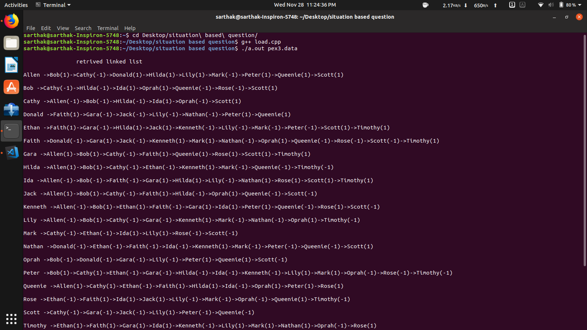
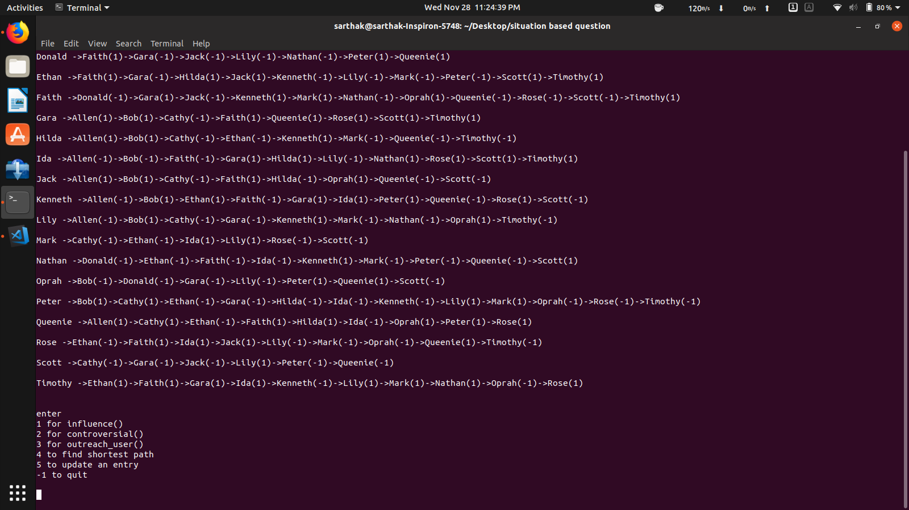
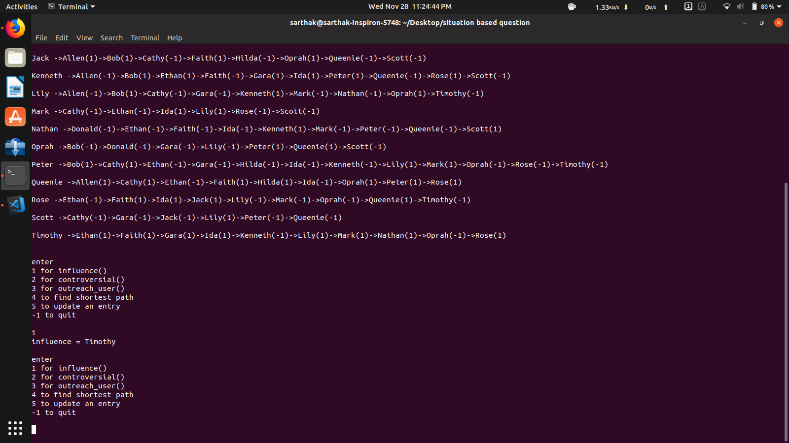
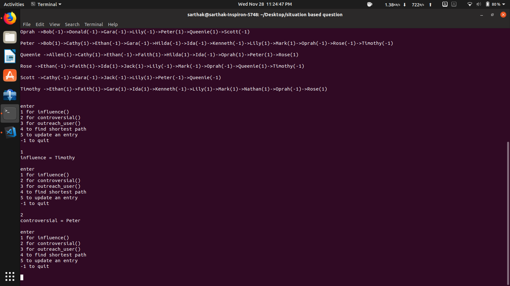
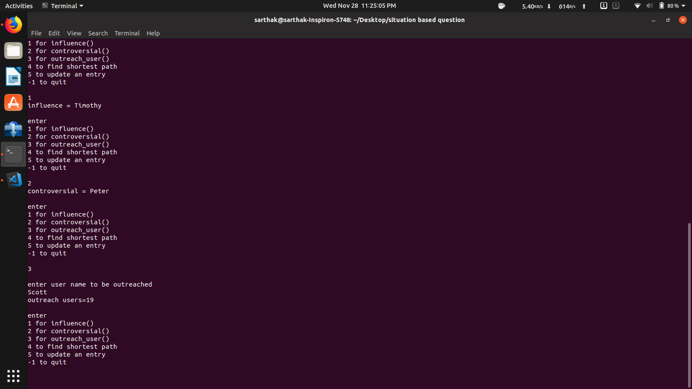
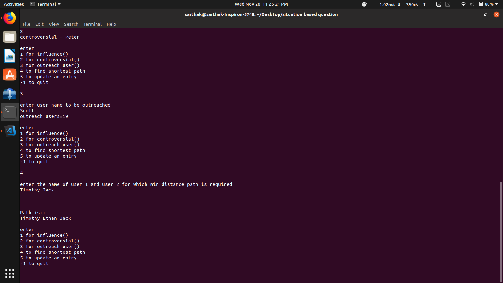
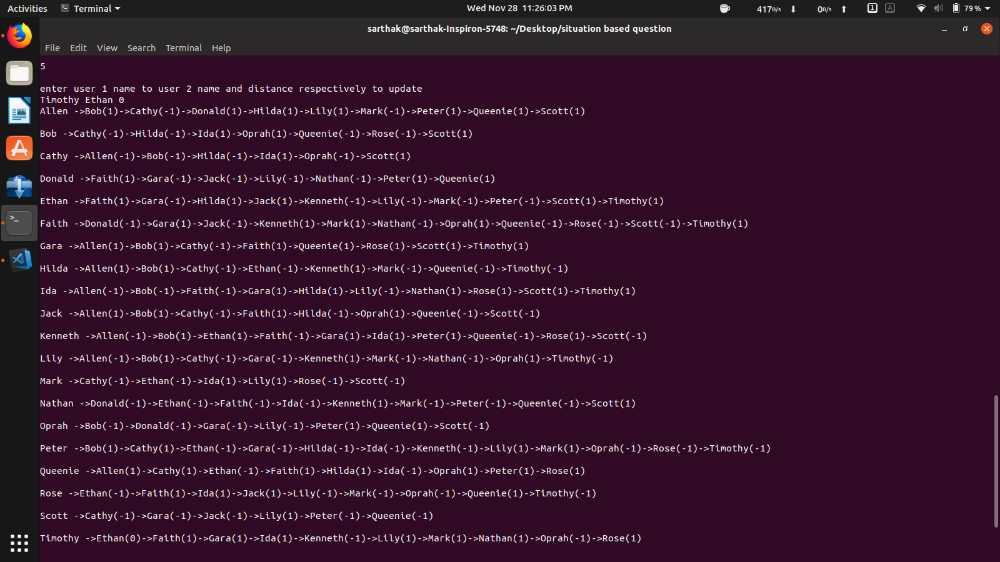
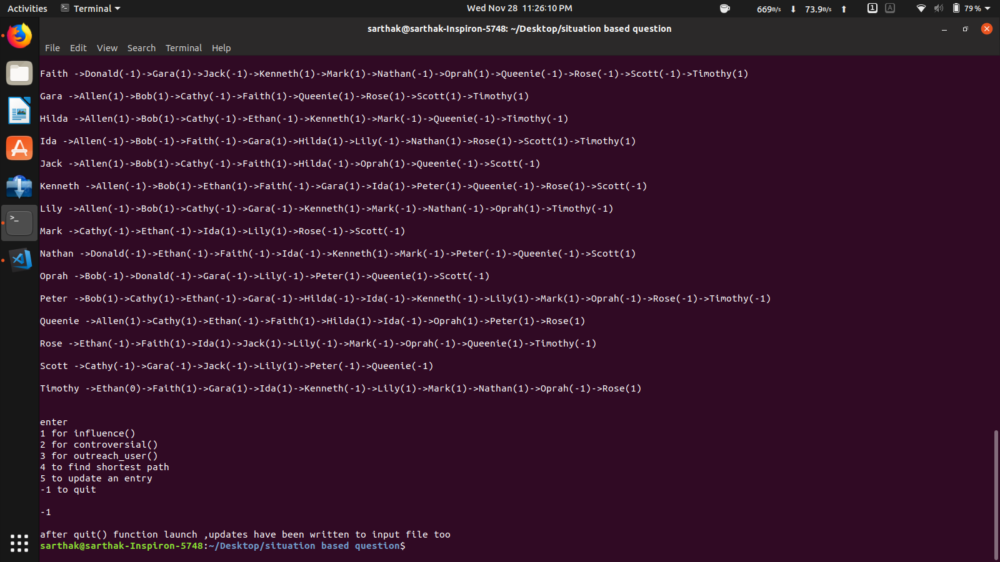

# graph-assignment

Get familiar with ADT graph, data structures to implement graphs and various graph algorithms.

  
  <b>Adjacency List</b>  
  
  <b>options</b>  
  
  <b>option1</b>  
  
  <b>option2</b>  
  
  <b>option3</b>  
  
  <b>option4</b>  
  
  <b>option5</b>  
  
  <b>option  -1</b>

Purpose

    Get familiar with ADT graph, data structures to implement graphs and various graph algorithms

The problem

Suppose that a company established a so called "influence" relationship among a set of social network users by collecting and analyzing these users' online activities. The company used a directed edge of distance 1 from user A to user B to indicate "A's opinion can positively influence B", and distance -1 to indicate "A's opinion can negatively influence B".

Note that the "influence" relationship is unidirectional. A having (either positive or negative) influence on B doesn't mean that B has any influence on A, positively or negatively. But the relationship is at least partially transitive. For example, if A has influence on B, and B has influence on C, then A has indirect influence on C, whether it is a positive influence or a negative one.

You are required to implement a program that simulates this "influence" relationship using a graph and provides answer to some queries.

Upon starting up, your program will take a file name as command line argument, and open and read from this data file the following information:

    an integer N, indicating the number of users;
    N user login names, one in each line; (You can assume that none of them exceeds 40 characters and there is no white space in the names.)
    Up to N*(N-1) lines of data in the format of "user1 user2 distance" (without the quotation marks), indicating a (direct) influence from user1 to user2. For example, "user1 user2 -1" means that user1's opinion negatively influences user2. You can safely make the assumption that there would not be more than one entry from user1 to user2. And if there is no entry from user1 to user2, it means that user2 is indifferent to user1's opinion.

You should use some appropriate data structures to store all the information. Then, your program should be able to handle the following user queries:  
<b>influence</b> 	<i> list the name of the user who can directly and positively influence the most number of the users </i>  
<b>controversial </b>	<i> list the name of the user who can directly influence the most number of the users, either positively or negatively </i>  
<b>outreach user</b> 	<i> count the number of the users this given user can influence, whether directly or indirectly, positively or negatively.
Don't count the same user more than once. </i>  
<b>link user1 user2 </b>	<i> list the shortest positive influence link from user1 to user2. Show the names of all the users in this link.
You should treat the negative influence as no influence for this query.
If there isn't such a link, display an appropriate message. </i>  
<b>update user1 user2 distance </b>	<i> update the influence distance from user1 to user2 with the new distance provided. You can safely assume that the distance is either 1, -1 or 0 </i>  
<b>quit </b>	<i> quit the system and write the updated data back to the original data file with the same format </i>
